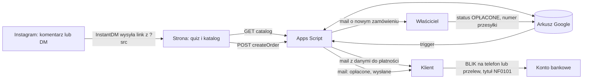

# Nicci Fragrance: system sprzedaży

Instagram przyprowadza ruch, strona dobiera zapach i przyjmuje zamówienie, arkusz Google jest bazą danych i panelem właściciela, a płatność idzie BLIKiem na telefon albo przelewem. Koszt stały: 0 zł (opcjonalnie domena).

## Pliki

| Plik | Do czego |
|---|---|
| `apps-script/Code.gs` | Backend: katalog, zamówienia, rezerwacje, statusy, maile, triggery. Szablony maili w sekcji `TEMPLATES`. |
| `site/nicci-api.js` | Moduł dla strony: katalog, filtry, koszyk, quiz, wysyłka zamówienia, przekazanie na Instagram. |
| `architektura-strony.md` | Mapa strony, sekcje, stany, formularz, strona płatności, brief do Claude Design. |
| `README.md` | Ten plik: uruchomienie, obsługa, testy. |

## Jak to działa



1. Komentarz pod Reelem uruchamia InstantDM, który wysyła link do quizu z parametrem `src`.
2. Klient robi quiz, dostaje 3 dopasowane zapachy, dodaje do koszyka, składa zamówienie.
3. Apps Script przelicza ceny z arkusza, sprawdza dostępne ml, rezerwuje je na 24 godziny, nadaje numer (NF0101, NF0102...) i wysyła dwa maile: klientowi dane do płatności, właścicielowi powiadomienie.
4. Strona pokazuje dane do płatności z przyciskami kopiowania i opcjonalny przycisk wysłania zamówienia na Instagram.
5. Właściciel widzi wpłatę z tytułem NF0101 w banku i zmienia status w arkuszu na OPŁACONE. System zdejmuje ml ze stanu, dopisuje wpis do Ewidencji i wysyła klientowi potwierdzenie.
6. Po nadaniu paczki właściciel wkleja numer przesyłki. Status zmienia się na WYSŁANE, klient dostaje mail z linkiem do śledzenia.
7. Co godzinę system wysyła przypomnienie (po 12 godzinach bez wpłaty) i wygasza nieopłacone rezerwacje (po 24 godzinach), oddając ml do katalogu.

Rezerwacje nie są zapisywane w stanach. Dostępność liczy się na bieżąco jako `ml_dostepne` minus ml z aktywnych zamówień NOWE, więc wygaśnięcie niczego nie musi "oddawać" i stany nie rozjeżdżają się przy błędach.

## Uruchomienie krok po kroku

### 1. Arkusz i backend

1. Utwórz nowy arkusz Google (albo zrób kopię arkusza z katalogiem). Rozszerzenia, Apps Script.
2. Wklej zawartość `Code.gs`. W Ustawieniach projektu ustaw strefę czasową Europe/Warsaw.
3. Uzupełnij `CONFIG` na górze pliku: e-mail właściciela, handle IG, adres strony, numer BLIK, numer konta, odbiorcę, ceny dostawy, próg darmowej dostawy.
4. Wybierz funkcję `setup` i kliknij Uruchom. Zaakceptuj uprawnienia (przy ekranie "Google nie zweryfikował aplikacji" wybierz Zaawansowane i przejdź do projektu, to normalne przy własnych skryptach). Powstaną zakładki Produkty, Zestawy, Zamowienia, Ewidencja, Log, lista statusów i dwa triggery.
5. Wypełnij zakładki Produkty i Zestawy (opis kolumn niżej). Dane z istniejącego arkusza katalogu przenieś kopiuj wklej, pilnując nazw kolumn.
6. Uruchom `diagnostyka` i sprawdź zakładkę Log. Nie może być wpisów "nie jest uzupełnione" ani "nie ma żadnej ceny".
7. Wdróż, Nowe wdrożenie, typ Aplikacja internetowa. Wykonaj jako: Ja. Kto ma dostęp: Każdy. Skopiuj adres kończący się na `/exec`.
8. Otwórz w przeglądarce `ADRES/exec?action=catalog`. Musisz zobaczyć JSON z `"ok":true` i listą produktów.

Każda zmiana kodu wymaga nowej wersji wdrożenia: Wdróż, Zarządzaj wdrożeniami, ołówek, Wersja: Nowa wersja. Adres się nie zmienia. Bez tego strona dalej korzysta ze starego kodu, to najczęstszy błąd.

### 2. Strona

1. Zbuduj stronę w Claude Design z briefu w `architektura-strony.md`.
2. Dołącz `nicci-api.js` i uzupełnij w nim `API_URL` (adres `/exec`) oraz `IG_HANDLE`.
3. Opublikuj na Cloudflare Pages (plan darmowy): nowy projekt, wgranie folderu albo połączenie z GitHubem. Pliki `zamowienie.html`, `potwierdzenie.html`, `regulamin.html`, `prywatnosc.html` będą dostępne pod adresami bez końcówki `.html`.
4. Adres strony wpisz w `CONFIG.SITE_URL` w Apps Script i wdróż nową wersję.

### 3. Bank

Aktywuj przyjmowanie przelewów BLIK na telefon dla numeru z `CONFIG.BLIK_PHONE` (w aplikacji banku, sekcja BLIK). Zrób próbny przelew na ten numer z innego konta i sprawdź, czy tytuł jest widoczny w historii.

### 4. Instagram

InstantDM (plan darmowy, 500 automatyzacji miesięcznie): automatyzacja komentarza ze słowem kluczowym dla każdego Reela, z osobnym `src` w linku.

Wiadomość po komentarzu:
```
Hej, dzięki za komentarz! Tu dobierzesz zapach w minutę: https://niccifragrance.pl/quiz?src=reel12 Odpowiesz na pięć krótkich pytań, a my pokażemy trzy odlewki, które najbardziej do Ciebie pasują.
```

Meta Business Suite, Skrzynka odbiorcza, Automatyzacje (darmowe):

Natychmiastowa odpowiedź na pierwszą wiadomość:
```
Cześć, tu Nicci Fragrance. Odpiszemy najszybciej, jak się da. Jeśli chcesz od razu dobrać zapach, zrób nasz krótki quiz: https://niccifragrance.pl/quiz?src=dm
```

Słowo kluczowe ZAMOWIENIE (wiadomość kopiowana ze strony zaczyna się od tego słowa):
```
Dzięki, mamy Twoje zamówienie. Dane do płatności wysłaliśmy też mailem. Gdy zobaczymy wpłatę, damy znać i zaczniemy odlewać Twoje zapachy.
```
Meta wysyła tę odpowiedź z opóźnieniem około 15 minut i może wymagać dokładnego dopasowania słowa. Sprawdź w teście, czy reaguje na dłuższą wiadomość zaczynającą się od ZAMOWIENIE. Jeśli nie, zostaw ją jako szybką odpowiedź do ręcznego wysłania.

Szybkie odpowiedzi do ręcznego użycia:
```
Płatność dotarła, dziękujemy. Paczka wyjdzie najpóźniej w [dzień], numer przesyłki wyślemy mailem.
```
```
Tego zapachu właśnie zabrakło, ale mamy bardzo podobny: [nazwa]. Możemy podmienić go w Twoim zamówieniu?
```

## Struktura arkusza

### Produkty (jeden wiersz na zapach)

| Kolumna | Przykład | Uwagi |
|---|---|---|
| id | p01 | unikalny, nie zmieniaj po starcie |
| aktywny | TAK | NIE ukrywa produkt |
| marka, nazwa | Xerjoff, Naxos | |
| rodzina | drzewna | jedna z: świeża, cytrusowa, aromatyczna, wodna, drzewna, skórzana, szyprowa, słodka, orientalna, ambrowa, gourmand, kwiatowa. Te nazwy łączą quiz z katalogiem. |
| profil | unisex | męski, damski, unisex |
| nuty_glowy, nuty_serca, nuty_bazy | lawenda, bergamotka | po przecinku |
| opis | | 2 do 3 zdań |
| sezon | jesień, zima | po przecinku z: wiosna, lato, jesień, zima |
| pora | wieczór | dzień, wieczór, uniwersalna |
| trwalosc, projekcja | 8 h, umiarkowana | tekst na kartę |
| intensywnosc | 2 | 1 blisko skóry, 2 wyczuwalny, 3 zostawia ślad (używane przez quiz) |
| cena_5, cena_10, cena_20 | 39, 69, 119 | w zł, puste pole ukrywa wariant |
| ml_dostepne | 92 | ile ml zostało we flakonie, aktualizuje się samo po płatności |
| podobne | p07, p12 | id podobnych zapachów |
| zdjecie_url | | link do zdjęcia (np. z hostingu strony) |
| kolejnosc | 1 | kolejność w katalogu |

### Zestawy

| Kolumna | Przykład |
|---|---|
| id | z01 |
| aktywny | TAK |
| nazwa, opis | Zestaw drzewny |
| rodzina | drzewna (quiz podpowiada zestaw z tej rodziny) |
| cena | 99 |
| sklad | p01:5, p07:5, p12:5 |

### Zamowienia

Wypełnia system. Właściciel edytuje tylko `status`, `numer_przesylki`, `przewoznik` i ewentualnie `uwagi`. Nie sortuj tej zakładki ręcznie w trakcie pracy triggerów. Do przeglądania używaj filtra.

### Ewidencja

Wpis przy każdej płatności i korekta przy anulowaniu opłaconego zamówienia. Służy jako rejestr wpłat.

## Codzienna obsługa (właściciel)

1. Rano i wieczorem otwórz aplikację banku i sprawdź wpłaty z tytułem NF.
2. W arkuszu włącz filtr `status = NOWE` i przy opłaconych zamówieniach zmień status na OPŁACONE. Mail do klienta, stan i ewidencja zrobią się same. Działa też z aplikacji Arkusze na telefonie (sprawdź w teście).
3. Odlej, spakuj, nadaj. Paczkomat to zawsze InPost, kuriera wybierasz sam (InPost, DPD albo DHL).
4. Przy kurierze wybierz firmę w kolumnie `przewoznik`. Wklej numer przesyłki w kolumnę `numer_przesylki`. Status zmieni się na WYSŁANE i klient dostanie link do śledzenia u tego przewoźnika. Przy paczkomacie kolumna `przewoznik` może zostać pusta.
5. Nowy flakon: dodaj jego ml do `ml_dostepne`. Koniec zapachu: `aktywny` na NIE albo zostaw z zerowym stanem (karta pokaże "Wyprzedane").

Termin realizacji: najpóźniej 7 dni roboczych od zaksięgowania wpłaty. Jeśli potrwa dłużej, klientowi należy się bon 50 zł na kolejne zakupy od 199 zł (regulamin, punkt 5).

Wpłata po terminie rezerwacji: i tak ustaw OPŁACONE i zrealizuj zamówienie. System wyśle Ci mail z prośbą o sprawdzenie dostępności. Jeśli zapachu brakuje, sprowadź go (do 5 dni roboczych). Zwrot pieniędzy: ustaw ANULOWANE (ml wrócą na stan, w ewidencji pojawi się korekta), a przelew zwrotny zrób ręcznie.

## Testy przed startem

1. Katalog: `?action=catalog` zwraca produkty, zmiana ceny w arkuszu widoczna na stronie po maksymalnie 5 minutach.
2. Zamówienie BLIK na własny e-mail: mail z danymi przyszedł, wiersz w Zamowienia, dostępność w katalogu spadła o zarezerwowane ml.
3. Zamówienie ze zbyt dużą ilością (ustaw na chwilę `ml_dostepne` na 5): strona pokazuje brak i podobne zapachy.
4. Status OPŁACONE: mail do klienta, spadek `ml_dostepne`, wpis w Ewidencji.
5. Numer przesyłki: status WYSŁANE, mail z działającym linkiem.
6. Wygaśnięcie: ustaw na chwilę `RESERVATION_HOURS: 1` i `REMINDER_AFTER_HOURS: 0`, wdróż, złóż zamówienie, poczekaj na trigger. Przyjdzie przypomnienie, potem mail o wygaśnięciu, a ml wrócą do katalogu. Przywróć wartości.
7. Formularz: błędny kod pocztowy, brak zgody, ukryte pole `website` wypełnione (zamówienie nie może powstać).
8. Instagram: komentarz pod testowym postem, DM z linkiem, przycisk "Wyślij zamówienie na Instagramie" na telefonie.
9. Maile nie lądują w spamie w Gmailu i Outlooku.

## Limity i ryzyka

Maile wychodzą z konta Google właściciela i obowiązuje dzienny limit wysyłki (funkcja `diagnostyka` pokazuje, ile zostało). Każde zamówienie to 2 maile, plus ewentualne przypomnienie i potwierdzenia.

InstantDM na darmowym planie wstrzymuje automatyzacje po wyczerpaniu miesięcznego limitu. Kontroluj licznik w połowie miesiąca, a przy stałym przekraczaniu przejdź na plan płatny.

Płatność weryfikuje człowiek, więc czas od wpłaty do potwierdzenia zależy od tego, jak często właściciel sprawdza bank. Warto napisać to wprost w FAQ ("potwierdzamy wpłaty dwa razy dziennie").

Przed startem sprzedaży muszą być gotowe regulamin i polityka prywatności. Kwestia VAT i kasy fiskalnej przy sprzedaży perfum online pozostaje otwarta. Zakładka Ewidencja rejestruje wpłaty, ale nie zastępuje fiskalizacji, więc skonsultuj sposób rozliczania z księgową przed zwiększeniem skali.
